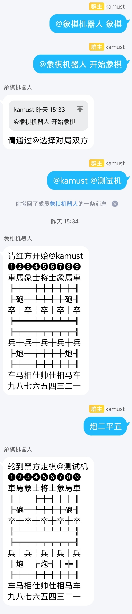
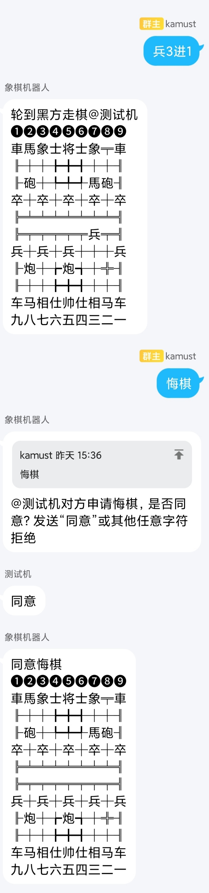
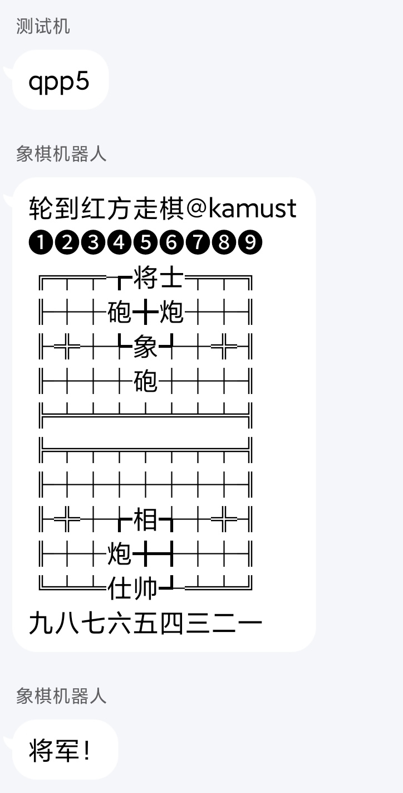

# qq群聊象棋机器人
基于[cchess](https://github.com/walker8088/cchess)、[mirai](https://github.com/mamoe/mirai)、[Graia Application](https://github.com/GraiaProject/Application)

## 演示

### 开始棋局

### 悔棋功能

### 规则判断

